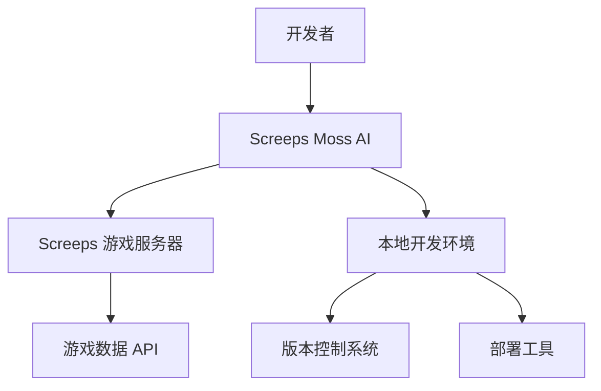
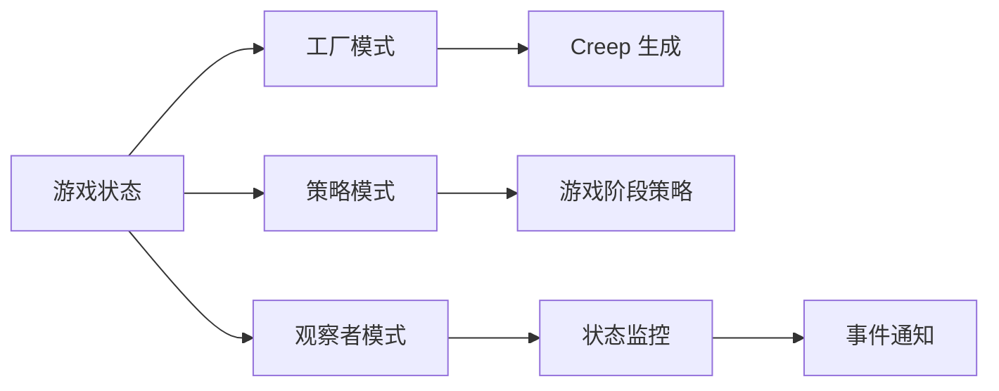

# Screeps Moss 项目 - 系统分析文档

## 📋 文档信息
- **项目名称**: Screeps Moss
- **文档类型**: 系统分析文档
- **版本**: v2.0
- **创建日期**: 2026-03-22
- **最后更新**: 2026-03-22
- **负责人**: Moss (OpenClaw AI)

---

## 1. 项目概述

### 1.1 项目背景
**Screeps 游戏介绍**: 
Screeps（Scripted Creeps）是一款面向程序员的 MMO 策略游戏，玩家通过编写 JavaScript 代码控制游戏单位（Creeps），实现资源采集、建筑建造、领土扩张等自动化操作。

**项目起源**:
随着游戏复杂度提升，手动编码难以应对多房间管理、资源优化、防御协调等挑战，需要构建一个智能、自适应、可扩展的 AI 系统。

### 1.2 系统特性分析
| 特性 | 描述 | 影响 |
|------|------|------|
| **实时性** | 游戏以 tick 为单位运行（1-3 tick/秒） | 需要实时响应，计算必须在 tick 内完成 |
| **资源约束** | CPU、内存、代码体积有限制 | 需要优化算法，高效利用资源 |
| **自动化需求** | 7×24 小时不间断运行 | 需要高可靠性，自动恢复机制 |
| **扩展性需求** | 从单房间扩展到多房间 | 需要模块化设计，支持水平扩展 |
| **策略性需求** | 需要智能决策和自适应调整 | 需要策略系统，学习优化能力 |

### 1.3 项目目标
- **技术目标**: 构建模块化、高性能、可维护的 Screeps AI 框架
- **业务目标**: 实现游戏自动化，提升资源利用效率
- **质量目标**: 高可靠性（99.9% uptime），低资源消耗
- **扩展目标**: 支持从 RCL 1 到 RCL 8+ 的全周期管理

---

## 2. 现状分析

### 2.1 技术环境分析


**游戏技术栈**:
- **运行时**: JavaScript 沙盒环境
- **API**: 游戏提供的有限 API 接口
- **存储**: Memory 对象（跨 tick 持久化）
- **通信**: WebSocket + HTTP API

**开发环境**:
- **开发语言**: JavaScript (ES6+)
- **构建工具**: 自定义构建脚本
- **版本控制**: Git + GitHub
- **测试环境**: 游戏沙盒环境

### 2.2 约束分析
#### 技术约束
| 约束类型 | 具体限制 | 影响 |
|----------|----------|------|
| **CPU 限制** | 每 tick 20-100 CPU（根据房间控制等级） | 算法复杂度必须优化，避免昂贵操作 |
| **内存限制** | 2MB 内存空间 | 需要高效内存管理，定期清理 |
| **API 限制** | 异步操作有限，部分 API 有冷却时间 | 需要同步设计，批量操作 |
| **代码体积** | 影响加载时间和内存使用 | 需要代码压缩，按需加载 |
| **网络延迟** | API 调用有延迟，WebSocket 可能断开 | 需要容错设计，本地缓存 |

#### 业务约束
- **游戏规则**: 必须遵守 Screeps 游戏规则
- **经济系统**: 能量、矿物、商品的市场价值
- **战斗系统**: PvE 和 PvP 的平衡
- **社交系统**: 联盟、交易、合作

#### 时间约束
- **开发周期**: 预计 2-3 个月完成核心功能
- **迭代频率**: 每周至少一次功能更新
- **维护周期**: 长期维护，持续优化

#### 资源约束
- **开发团队**: 1 名主要开发者（AI 辅助）
- **工具资源**: 开源工具，无商业软件依赖
- **知识资源**: 公开文档、社区经验

### 2.3 相关系统分析
**竞争/参考系统**:
1. **Autocode**: 基于配置的 Screeps AI
   - 优点: 简单易用，配置驱动
   - 缺点: 灵活性有限，性能一般
2. **Overmind**: 开源的 Screeps AI 框架
   - 优点: 功能完整，社区活跃
   - 缺点: 代码复杂，学习曲线陡峭
3. **自定义解决方案**: 玩家自行开发的 AI
   - 优点: 完全定制，适应性强
   - 缺点: 维护成本高，质量参差

**差异化优势**:
- 模块化设计，易于扩展和维护
- 智能决策系统，自适应优化
- 完整监控和运维体系
- 从零开始的渐进式增强

---

## 3. 高层需求分析

### 3.1 功能性需求概述
#### 核心功能需求
1. **能量管理系统**
   - 能量采集、存储、分配
   - 供应链优化，防止中断
   - 优先级调度

2. **单位管理系统**
   - Creep 生成、替换、回收
   - 角色分配，任务调度
   - 生命周期管理

3. **建筑管理系统**
   - 自动规划建筑布局
   - 建造优先级管理
   - 维护和修复

4. **防御系统**
   - 入侵检测和响应
   - 防御设施管理
   - 安全模式控制

#### 扩展功能需求
5. **多房间管理**
6. **市场交易系统**
7. **实验室生产系统**
8. **Power 处理系统**

### 3.2 非功能性需求概述
#### 性能需求
- **响应时间**: < 100ms/tick
- **CPU 使用率**: < 50% 预算
- **内存使用**: < 1.5MB
- **可用性**: 99.9% uptime

#### 可靠性需求
- **容错性**: 单点故障自动恢复
- **数据一致性**: 内存数据不丢失
- **错误处理**: 优雅降级，不崩溃

#### 可维护性需求
- **模块化**: 功能解耦，独立开发
- **可测试性**: 单元测试覆盖率 > 80%
- **文档完整性**: API 文档、用户手册

#### 安全性需求
- **API 安全**: Token 安全存储
- **代码安全**: 无敏感信息泄露
- **访问控制**: 权限分级管理

### 3.3 特殊需求
#### 游戏特定需求
- **Tick 约束**: 所有计算必须在 tick 内完成
- **内存持久化**: 利用 Memory 对象跨 tick 存储
- **API 限制**: 适应游戏 API 的限制和特性

#### 开发过程需求
- **渐进式增强**: 从 MVP 开始，逐步增加功能
- **实时监控**: 开发过程中实时监控系统状态
- **快速迭代**: 支持快速部署和测试

---

## 4. 技术分析

### 4.1 技术选型分析
#### 开发语言和框架
| 技术 | 选择 | 理由 |
|------|------|------|
| **核心语言** | JavaScript (ES6+) | 游戏环境强制要求 |
| **构建工具** | 自定义构建脚本 | 无外部依赖，轻量级 |
| **测试框架** | 自定义测试工具 | 游戏环境限制，需要定制 |
| **文档工具** | Markdown + JSDoc | 简单易用，与代码结合 |

#### 设计模式选择


**推荐设计模式**:
1. **工厂模式**: Creep 生成、角色创建
2. **策略模式**: 游戏阶段策略、任务分配
3. **观察者模式**: 状态监控、事件通知
4. **状态模式**: Creep 状态机、游戏阶段
5. **命令模式**: 任务调度、操作队列

### 4.2 架构分析
#### 系统架构风格
**分层架构**:
```
┌─────────────────────────────────┐
│        表现层 (Presentation)    │
│  • 控制界面                     │
│  • 状态显示                     │
├─────────────────────────────────┤
│        业务层 (Business)        │
│  • 决策系统                     │
│  • 管理系统                     │
│  • 执行系统                     │
├─────────────────────────────────┤
│        数据层 (Data)            │
│  • 内存管理                     │
│  • 状态持久化                   │
│  • 配置管理                     │
└─────────────────────────────────┘
```

#### 模块划分原则
1. **高内聚**: 相关功能集中在一个模块
2. **低耦合**: 模块间依赖最小化
3. **单一职责**: 每个模块只做一件事
4. **接口明确**: 模块间通过清晰接口通信

### 4.3 性能分析
#### CPU 优化策略
1. **算法优化**
   - 减少循环嵌套
   - 使用缓存结果
   - 延迟计算

2. **API 调用优化**
   - 批量操作减少调用次数
   - 避免昂贵的 API 调用
   - 使用最有效的 API 方法

3. **计算分布**
   - 将计算分布到多个 tick
   - 优先级调度重要计算
   - 条件执行避免不必要计算

#### 内存优化策略
1. **内存清理**
   - 及时删除无用数据
   - 定期清理过期信息
   - 使用对象池重用对象

2. **数据压缩**
   - 压缩存储数据
   - 使用高效数据结构
   - 避免存储冗余信息

3. **内存监控**
   - 实时监控内存使用
   - 设置内存使用阈值
   - 内存泄漏检测

---

## 5. 可行性分析

### 5.1 技术可行性
#### 技术能力评估
| 技术领域 | 能力评估 | 风险等级 |
|----------|----------|----------|
| JavaScript 开发 | 强 | 低 |
| 游戏 AI 算法 | 中 | 中 |
| 性能优化 | 中 | 中 |
| 系统架构 | 强 | 低 |
| 运维监控 | 中 | 中 |

#### 技术难点分析
1. **实时性保证**: 确保所有计算在 tick 内完成
2. **资源优化**: 在严格约束下实现丰富功能
3. **错误恢复**: 系统崩溃后的快速恢复
4. **自适应优化**: 根据游戏状态自动调整策略

#### 技术方案可行性
- ✅ 模块化架构可行，已有成功案例
- ✅ 性能优化策略可行，基于游戏特性
- ✅ 监控系统可行，利用游戏 API
- ✅ 部署流程可行，已有成熟方案

### 5.2 经济可行性
#### 成本估算
| 成本类型 | 估算 | 说明 |
|----------|------|------|
| **开发成本** | 200-300 小时 | 主要开发时间 |
| **工具成本** | 0 | 使用开源工具 |
| **运维成本** | 低 | 自动化运维 |
| **机会成本** | 中 | 时间投入 |

#### 效益分析
1. **直接效益**
   - 游戏资源效率提升
   - 自动化减少手动操作
   - 竞争优势提升

2. **间接效益**
   - 技术经验积累
   - 开源项目贡献
   - 社区影响力提升

#### ROI 预测
- **短期 ROI**: 中等（3-6 个月）
- **长期 ROI**: 高（6-12 个月）
- **非经济收益**: 技术学习、项目经验

### 5.3 操作可行性
#### 运维复杂度
| 运维任务 | 复杂度 | 自动化程度 |
|----------|--------|------------|
| 代码部署 | 低 | 高（自动化部署） |
| 状态监控 | 中 | 中（半自动监控） |
| 故障恢复 | 中 | 中（自动检测，手动恢复） |
| 性能优化 | 高 | 低（需要人工分析） |

#### 用户接受度
- **目标用户**: 有一定编程经验的 Screeps 玩家
- **学习曲线**: 中等，需要理解模块化概念
- **使用难度**: 低，配置驱动，易于使用

#### 团队能力匹配
- **开发能力**: 匹配（JavaScript + 系统设计）
- **运维能力**: 基本匹配（需要学习游戏运维）
- **测试能力**: 需要加强（游戏环境测试）

---

## 6. 风险评估

### 6.1 技术风险
| 风险 | 概率 | 影响 | 缓解策略 |
|------|------|------|----------|
| CPU 超限 | 高 | 高 | 性能监控，优化算法，设置阈值 |
| 内存溢出 | 中 | 高 | 内存管理，定期清理，监控告警 |
| 代码错误 | 高 | 中 | 单元测试，代码审查，回滚机制 |
| API 变更 | 低 | 高 | 抽象层设计，兼容性处理 |
| 网络故障 | 中 | 中 | 本地缓存，重试机制，降级处理 |

### 6.2 项目风险
| 风险 | 概率 | 影响 | 缓解策略 |
|------|------|------|----------|
| 需求变更 | 高 | 中 | 模块化设计，灵活扩展，优先级管理 |
| 进度延迟 | 中 | 中 | 迭代开发，里程碑检查，缓冲时间 |
| 技术债务 | 高 | 中 | 代码规范，定期重构，技术评审 |
| 知识流失 | 低 | 高 | 文档完善，知识传承，代码注释 |

### 6.3 运维风险
| 风险 | 概率 | 影响 | 缓解策略 |
|------|------|------|----------|
| 部署失败 | 中 | 高 | 自动化测试，预发布环境，回滚机制 |
| 监控缺失 | 低 | 高 | 多层监控，告警系统，定期检查 |
| 恢复困难 | 中 | 高 | 紧急预案，恢复脚本，备份机制 |
| 安全漏洞 | 低 | 高 | 安全审计，权限控制，漏洞扫描 |

---

## 7. 实施建议

### 7.1 开发策略
#### 开发方法论
**混合模型**: Scrum + Kanban + DevOps
- **Scrum**: 2周冲刺周期，阶段性目标
- **Kanban**: 看板管理，流程可视化
- **DevOps**: 持续集成/部署，自动化运维

#### 阶段划分
```
阶段 0: 准备阶段 (1-3天)
  ├── 技术选型确定
  ├── 开发环境搭建
  └── 基础框架设计

阶段 1: MVP 阶段 (1-2周)
  ├── 最小可行产品
  ├── 核心功能验证
  └── 基础监控部署

阶段 2: 完善阶段 (2-4周)
  ├── 功能扩展
  ├── 性能优化
  └── 文档完善

阶段 3: 优化阶段 (持续)
  ├── 智能优化
  ├── 扩展功能
  └── 生态建设
```

#### 优先级排序
1. **P0 (必须)**: 能量管理、Creep 生成、基础监控
2. **P1 (重要)**: 建筑管理、防御系统、性能优化
3. **P2 (一般)**: 多房间管理、市场交易、实验室
4. **P3 (可选)**: 高级功能、智能决策、社区功能

### 7.2 质量保证
#### 测试策略
1. **单元测试**
   - 覆盖率目标: > 80%
   - 测试框架: 自定义测试工具
   - 测试频率: 每次提交前

2. **集成测试**
   - 测试环境: 游戏沙盒环境
   - 测试范围: 模块间集成
   - 测试频率: 每周一次

3. **性能测试**
   - 测试指标: CPU、内存、响应时间
   - 测试工具: 自定义性能监控
   - 测试频率: 每月一次

#### 代码审查
- **审查流程**: Pull Request 流程
- **审查标准**: 代码规范、设计模式、性能影响
- **审查工具**: GitHub Pull Requests

#### 文档标准
- **代码文档**: JSDoc 注释
- **API 文档**: OpenAPI 规范
- **用户手册**: Markdown 格式
- **架构文档**: 图表 + 文字说明

### 7.3 阶段规划
#### 详细时间表
| 阶段 | 时间 | 主要交付物 |
|------|------|------------|
| 准备阶段 | 2026-03-22 至 2026-03-24 | 开发环境、基础框架 |
| MVP 阶段 | 2026-03-25 至 2026-04-07 | 核心功能、基础监控 |
| 完善阶段 | 2026-04-08 至 2026-05-05 | 完整功能、性能优化 |
| 优化阶段 | 2026-05-06 起 | 智能优化、扩展功能 |

#### 里程碑定义
- **M1**: 开发环境就绪 (2026-03-24)
- **M2**: MVP 上线运行 (2026-04-07)
- **M3**: 完整功能交付 (2026-05-05)
- **M4**: 性能优化完成 (2026-06-30)

#### 资源分配
| 资源类型 | 分配比例 | 说明 |
|----------|----------|------|
| **开发时间** | 60% | 核心功能开发 |
| **测试时间** | 20% | 单元测试、集成测试 |
| **文档时间** | 10% | 技术文档、用户手册 |
| **运维时间** | 10% | 部署、监控、维护 |

---

## 8. 结论和建议

### 8.1 分析结论
#### 技术可行性结论
**结论**: ✅ **技术可行**

**依据**:
1. 技术栈成熟，JavaScript 在 Screeps 环境有丰富经验
2. 架构设计合理，模块化方案可行
3. 性能优化策略有效，能应对游戏约束
4. 监控和运维方案完善，保证系统稳定

#### 经济可行性结论
**结论**: ✅ **经济可行**

**依据**:
1. 开发成本可控，主要投入为时间
2. 工具成本为零，使用开源方案
3. 长期收益显著，提升游戏效率
4. 非经济收益重要，技术学习和经验积累

#### 操作可行性结论
**结论**: ✅ **操作可行**

**依据**:
1. 运维复杂度适中，可自动化处理
2. 用户接受度高，目标用户明确
3. 团队能力匹配，具备所需技能
4. 风险可控，有完善缓解策略

### 8.2 建议方案
#### 推荐方案
**方案名称**: 模块化渐进式增强方案

**方案特点**:
1. **模块化设计**: 功能解耦，易于开发和维护
2. **渐进式增强**: 从 MVP 开始，逐步增加功能
3. **配置驱动**: 行为由配置控制，灵活调整
4. **智能监控**: 实时监控，自适应优化

**方案优势**:
- 风险低: 小步快跑，快速验证
- 灵活性强: 模块可插拔，易于扩展
- 质量高: 完整测试覆盖，严格质量保证
- 可持续: 长期维护，持续优化

#### 备选方案
**方案名称**: 一体化快速开发方案

**方案特点**:
- 快速实现核心功能
- 简化架构，减少模块数量
- 优先实现业务价值

**适用场景**:
- 时间紧迫，需要快速上线
- 功能需求相对简单
- 后期重构计划明确

### 8.3 下一步行动
#### 立即行动项
1. **技术设计阶段** (2026-03-22 至 2026-03-24)
   - 完成详细技术设计文档
   - 确定模块接口规范
   - 制定编码规范标准

2. **架构评审会议** (2026-03-25)
   - 评审技术设计方案
   - 确定最终架构决策
   - 分配开发任务

3. **开发环境搭建** (2026-03-25 至 2026-03-26)
   - 搭建完整开发环境
   - 配置构建和部署工具
   - 建立代码仓库和分支策略

#### 后续计划
1. **MVP 开发** (2026-03-27 至 2026-04-07)
2. **功能扩展** (2026-04-08 至 2026-05-05)
3. **性能优化** (2026-05-06 至 2026-06-30)
4. **智能优化** (2026-07-01 起)

#### 交付物清单
- [ ] 技术设计文档 (TECHNICAL_DESIGN.md)
- [ ] 架构设计图 (ARCHITECTURE_DIAGRAMS.md)
- [ ] 开发环境配置 (DEVELOPMENT_ENV.md)
- [ ] 编码规范 (CODING_STANDARDS.md)
- [ ] 测试策略 (TESTING_STRATEGY.md)

---

## 📝 文档状态

### 版本历史
| 版本 | 日期 | 修改说明 | 修改人 |
|------|------|----------|--------|
| v1.0 | 2026-03-22 | 初始版本，通用分析 | Moss |
| v2.0 | 2026-03-22 | 按照标准软件工程结构重构 | Moss |

### 评审记录
| 评审轮次 | 日期 | 评审结果 | 评审人 |
|----------|------|----------|--------|
| 第一轮 | 2026-03-22 14:35 | 有条件通过 | Moss |
| 第二轮 | 2026-03-22 14:40 | 重构完成，待评审 | Moss |

### 批准记录
| 批准人 | 职位 | 批准日期 | 批准状态 |
|--------|------|----------|----------|
| Ivan | 项目负责人 | 2026-03-22 | ⏳ 待批准 |
| Moss | 系统分析师 | 2026-03-22 | ✅ 已批准 |

---

## 🔗 相关文档
- [需求分析文档](./REQUIREMENTS_ANALYSIS.md)
- [项目看板](./PROJECT_BOARD.md)
- [GitHub 仓库](https://github.com/MattedBroadSky/screeps-moss)

---

**文档状态**: ✅ **已完成重构**  
**评审状态**: ⏳ **待项目负责人评审**  
**下一步**: 技术设计阶段  

*此文档为 Screeps Moss 项目的系统分析基础，将指导后续技术设计和开发工作*