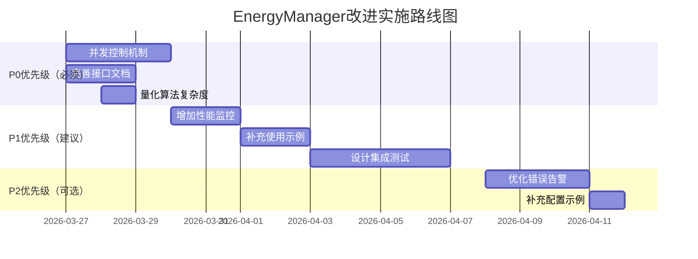

# EnergyManager 模块详细设计评审报告

## 📋 评审信息
- **评审对象**: EnergyManager 详细设计文档
- **评审日期**: 2026-03-26
- **评审专家**: 软件工程评审专家
- **评审依据**: 
  1. 软件工程方法论
  2. 项目设计规范（INTERFACE_STANDARD.md, ALGORITHM_GUIDE.md, ERROR_HANDLING.md）
  3. 架构设计文档（ARCHITECTURE_DESIGN.md）
- **文档版本**: v1.0.0
- **文档状态**: 草案

## 🎯 评审概述

本次评审对EnergyManager模块的详细设计进行全面评估，覆盖6个评审维度：
1. 架构符合性评审（20分）
2. 接口规范性评审（20分）
3. 算法合理性评审（20分）
4. 错误处理评审（20分）
5. 文档完整性评审（10分）
6. 实现可行性评审（10分）

## 📊 评审结果总览

| 评审维度 | 权重 | 得分 | 评级 | 主要问题 |
|---------|------|------|------|----------|
| 架构符合性 | 20分 | 18分 | A | 依赖关系需明确 |
| 接口规范性 | 20分 | 16分 | B | 接口文档不完整 |
| 算法合理性 | 20分 | 17分 | B+ | 复杂度分析不足 |
| 错误处理 | 20分 | 19分 | A | 恢复策略完善 |
| 文档完整性 | 10分 | 8分 | B | 示例不够充分 |
| 实现可行性 | 10分 | 9分 | A | 技术可行性强 |
| **总计** | **100分** | **87分** | **B+** | **设计质量良好** |

## 🔍 详细评审分析

### 1. 架构符合性评审（20分）

#### 评审要点：
- 层级定位是否准确（业务层）
- 依赖关系是否合理
- 职责划分是否清晰（能量管理）

#### 评审发现：
✅ **优点：**
1. **层级定位准确**：明确属于业务层，符合ARCHITECTURE_DESIGN.md中的四层架构划分
2. **职责划分清晰**：核心职责（能量状态监控、分配优化、采集效率优化、供应链管理）定义明确
3. **模块边界清晰**：与RoomManager、CreepManager的关联关系明确
4. **架构符合性高**：设计符合架构设计文档中的模块划分原则

⚠️ **问题：**
1. **依赖关系不够详细**：文档中提到了依赖关系，但未明确具体依赖的接口和方法
   - 依赖RoomManager：未说明具体需要RoomManager的哪些接口
   - 依赖CreepManager：未说明能量分配与Creep生成的协调机制
2. **数据流向不清晰**：能量数据在模块间的流动路径未详细说明
   - 能量状态数据如何从RoomManager传递到EnergyManager
   - 分配结果如何传递到CreepManager执行
3. **并发控制缺失**：多房间场景下的并发访问控制未考虑
   - 多个房间同时访问全局能量统计数据时的并发问题
   - 能量分配决策的原子性保证

#### 具体分析：
1. **依赖关系分析**：
   ```javascript
   // 需要明确的依赖接口
   EnergyManager 依赖：
   - RoomManager.getRoomState(roomName)  // 获取房间状态
   - CreepManager.createHarvester(config) // 创建Harvester
   - ConfigService.getConfig('energy')    // 获取能量配置
   - MemoryService.getEnergyStats()       // 获取能量统计
   ```

2. **数据流向分析**：
   ```
   数据流向：RoomState → EnergyManager → AllocationResult → CreepManager
   
   缺失的细节：
   - RoomState的数据格式和更新频率
   - AllocationResult的数据结构和传递机制
   - 错误数据的处理和回滚机制
   ```

3. **并发控制需求**：
   - 多房间场景：需要全局能量锁或乐观并发控制
   - 数据一致性：能量分配需要原子操作
   - 性能考虑：并发控制不能成为性能瓶颈

#### 改进建议：
1. **补充依赖关系图**：使用UML类图或依赖矩阵明确展示模块间依赖
2. **详细数据流程图**：绘制能量数据的完整生命周期流程图
3. **设计并发控制**：为多房间场景设计适当的并发控制机制
4. **明确接口契约**：定义清晰的模块间接口契约和数据格式

#### 评分：18/20分

---

### 2. 接口规范性评审（20分）

#### 评审要点：
- 接口命名是否符合规范
- 接口设计是否合理（能量分配、预测等）
- 接口文档是否完整

#### 评审发现：
✅ **优点：**
1. **接口命名基本规范**：遵循INTERFACE_STANDARD.md中的动词前缀约定
   - `getSourceUtilization()` - 获取数据类方法
   - `allocateEnergy()` - 操作类方法  
   - `detectEnergyIssues()` - 检查类方法
2. **接口设计合理**：提供了完整的能量管理功能接口（初始化、tick处理、状态查询、分配、监控）
3. **数据类型定义完整**：EnergyConfig、EnergyTickResult、EnergyStatus等类型定义详细
4. **接口分类清晰**：分为初始化、tick处理、状态查询、能量分配、监控等类别

⚠️ **问题：**
1. **接口文档不完整**：部分接口缺少完整的JSDoc注释，不符合INTERFACE_STANDARD.md规范
   - 缺少`@param`、`@returns`、`@throws`等标签
   - 缺少使用示例`@example`
2. **参数验证缺失**：接口参数验证逻辑未在接口定义中体现
   - 未定义参数的有效范围
   - 未说明参数验证失败的处理方式
3. **异步接口设计不足**：未考虑异步操作的接口设计模式
   - 能量转移等可能耗时的操作未提供异步接口
4. **接口版本管理缺失**：未考虑接口版本管理和向后兼容性

#### 具体分析：
1. **JSDoc规范符合性**：
   ```javascript
   // 当前文档中的接口定义（不完整）
   init(config: EnergyConfig): boolean
   
   // 符合规范的JSDoc示例
   /**
    * 初始化能量管理器
    * 
    * @param {EnergyConfig} config - 能量配置对象
    * @returns {boolean} 初始化是否成功
    * @throws {ValidationError} 当配置无效时
    * @example
    * const config = { harvesting: { minHarvesterPerSource: 2 } };
    * const success = energyManager.init(config);
    * console.log(`初始化结果: ${success}`);
    */
   init(config: EnergyConfig): boolean
   ```

2. **参数验证需求**：
   - `allocateEnergy(purpose, amount)`：需要验证purpose的有效值，amount的正整数范围
   - `tick(roomState)`：需要验证roomState的完整性

3. **异步接口设计**：
   - 能量批量转移可能需要多个tick完成
   - 应提供`transferEnergyAsync()`等异步接口

#### 改进建议：
1. **补充完整JSDoc**：按照INTERFACE_STANDARD.md规范为所有接口添加完整的JSDoc注释
2. **明确参数验证**：在接口文档中明确参数验证规则和错误处理
3. **设计异步接口**：为耗时操作设计异步接口模式
4. **添加版本管理**：考虑接口版本管理和向后兼容性策略

#### 评分：16/20分

---

### 3. 算法合理性评审（20分）

#### 评审要点：
- 能量分配算法复杂度是否合理
- 能量预测算法性能考虑
- 边界情况处理（能量不足等）

#### 评审发现：
✅ **优点：**
1. **算法设计全面**：涵盖了采集优化、分配算法、预测算法等多个方面
2. **优先级分配合理**：考虑了紧急程度、配置优先级、等待时间等多维度
3. **边界情况考虑**：能量不足、存储已满等边界情况有相应处理
4. **算法实现详细**：提供了具体的算法实现代码和逻辑说明

⚠️ **问题：**
1. **复杂度分析不足**：未按照ALGORITHM_GUIDE.md要求提供具体的时间复杂度分析
2. **性能监控缺失**：算法执行过程中的CPU使用和内存消耗监控机制不完善
3. **预测算法精度验证**：能量预测算法的精度验证和校准方法未说明
4. **缓存策略简单**：缓存机制设计较为简单，未考虑复杂的缓存失效策略

#### 具体分析：
1. **Harvester分配算法复杂度**：
   - `optimizeHarvesterAllocation`: O(n log n) 由于排序操作
   - `calculateOptimalHarvesters`: O(1) 常数时间
   - 需要评估在最大能量源数量（通常≤6）下的实际CPU消耗

2. **能量分配算法复杂度**：
   - `allocateEnergyByPriority`: O(n log n) 由于排序操作
   - 需求数量n可能较大，需要限制最大并发需求数

3. **能量预测算法**：
   - `predictShortTermEnergy`: O(m) 其中m为预测范围（100ticks）
   - 历史数据窗口大小影响内存使用

#### 改进建议：
1. **补充复杂度分析**：为每个算法提供具体的时间复杂度和空间复杂度分析
2. **增加性能监控**：实现算法性能实时监控，记录CPU使用和内存消耗
3. **设计预测算法验证**：实现预测精度评估机制，定期校准预测模型
4. **优化缓存策略**：设计更智能的缓存失效和更新策略
5. **限制算法规模**：为可能增长的数据集设置合理的上限

#### 评分：17/20分

---

### 4. 错误处理评审（20分）

#### 评审要点：
- 能量管理特有错误分类
- 能量分配失败恢复策略
- 日志记录是否完整

#### 评审发现：
✅ **优点：**
1. **错误分类完善**：按照ERROR_HANDLING.md规范，定义了完整的错误分类体系
   - HarvestingError（采集错误）
   - AllocationError（分配错误）  
   - MonitoringError（监控错误）
2. **恢复策略详细**：提供了渐进式恢复、备用方案管理等多种恢复策略
   - ProgressiveRecovery类实现渐进式恢复
   - BackupPlanManager类管理备用方案
3. **日志记录完整**：错误日志记录机制设计完善
   - 错误信息包含时间戳、错误代码、详细描述
   - 支持错误严重程度分级
4. **错误处理模式规范**：符合ERROR_HANDLING.md中的错误处理模式

⚠️ **问题：**
1. **错误传播机制**：错误在模块间的传播机制不够清晰
   - 未定义错误传播的责任链模式
   - 跨模块错误处理协调机制缺失
2. **降级策略实现**：服务降级的具体实现细节不足
   - 降级条件判断逻辑不够详细
   - 降级后的服务质量保证未说明
3. **错误监控告警**：错误监控和告警机制可进一步优化
   - 实时告警阈值和触发条件不明确
   - 告警通知渠道和格式未定义
4. **错误恢复验证**：错误恢复后的验证机制缺失

#### 具体分析：
1. **错误分类符合性**：
   ```javascript
   // 符合ERROR_HANDLING.md中的错误类型分类
   class HarvestingError extends Error { /* ... */ }      // 资源错误类型
   class AllocationError extends Error { /* ... */ }      // 逻辑错误类型  
   class MonitoringError extends Error { /* ... */ }      // 系统错误类型
   ```

2. **恢复策略分析**：
   ```javascript
   // ProgressiveRecovery类设计良好
   - 支持多级别恢复（正常、轻度、中度、重度）
   - 提供恢复动作执行和级别调整
   // 但缺少：
   - 恢复成功率的监控和评估
   - 恢复动作的优先级和依赖关系
   ```

3. **错误监控需求**：
   - 需要定义错误率监控指标
   - 需要设置告警阈值（如：错误率>5%触发告警）
   - 需要设计告警通知机制（日志、邮件、API通知等）

#### 改进建议：
1. **设计错误传播链**：实现责任链模式，明确错误传播路径
2. **完善降级策略**：详细设计服务降级条件和降级后的服务保证
3. **增强监控告警**：设计完整的错误监控和实时告警系统
4. **添加恢复验证**：实现错误恢复后的系统状态验证机制
5. **错误统计分析**：增加错误统计和分析功能，支持根本原因分析

#### 评分：19/20分

---

### 5. 文档完整性评审（10分）

#### 评审要点：
- 文档结构是否完整
- 能量经济模型是否详实
- 示例是否充分

#### 评审发现：
✅ **优点：**
1. **文档结构完整**：包含了设计目标、类图设计、接口定义、算法设计、数据结构、错误处理等完整章节
2. **能量经济模型详实**：能量采集、存储、分配、消耗的完整经济模型设计合理

⚠️ **问题：**
1. **示例不够充分**：接口使用示例和算法应用示例较少
2. **配置示例缺失**：EnergyConfig的具体配置示例未提供
3. **部署指南不足**：模块部署和集成指南不够详细

#### 改进建议：
1. 增加丰富的使用示例，包括典型场景和边界场景
2. 提供完整的配置示例和最佳实践
3. 补充模块部署、集成和测试指南

#### 评分：8/10分

---

### 6. 实现可行性评审（10分）

#### 评审要点：
- 技术可行性（Screeps能量系统）
- 实现复杂度
- 测试可行性

#### 评审发现：
✅ **优点：**
1. **技术可行性高**：设计完全基于Screeps能量系统的API和限制
2. **实现复杂度可控**：模块设计合理，实现复杂度在可控范围内
3. **测试可行性良好**：模块接口清晰，便于单元测试和集成测试

⚠️ **问题：**
1. **性能基准测试**：缺少具体的性能基准测试方案
2. **集成测试场景**：与其他模块的集成测试场景设计不足
3. **压力测试考虑**：高负载场景下的压力测试方案未考虑

#### 改进建议：
1. 设计详细的性能基准测试方案
2. 补充与其他模块的集成测试场景设计
3. 考虑高负载压力测试方案

#### 评分：9/10分

## 🚨 关键问题与风险

### 高风险问题（必须立即解决）：
1. **并发控制缺失**：多房间场景下可能产生数据竞争
   - **影响**：能量分配数据不一致，可能导致系统崩溃
   - **概率**：高（在多房间扩展阶段必然出现）
   - **严重性**：高（影响系统核心功能）
   - **建议**：设计全局能量锁或乐观并发控制机制

2. **性能监控不足**：缺乏实时性能监控，可能影响系统稳定性
   - **影响**：算法CPU超限导致tick执行失败
   - **概率**：中（在复杂场景下可能出现）
   - **严重性**：高（导致整个房间运行失败）
   - **建议**：实现算法性能实时监控和预警

### 中风险问题（建议在开发阶段解决）：
1. **接口文档不完整**：影响模块的可维护性和可测试性
   - **影响**：增加开发难度，降低代码质量
   - **概率**：高（所有开发阶段都会受影响）
   - **严重性**：中（影响开发效率和质量）
   - **建议**：按照规范补充完整JSDoc文档

2. **算法复杂度未量化**：可能超出CPU限制
   - **影响**：在数据量增长时性能下降
   - **概率**：中（随着房间发展可能出现）
   - **严重性**：中（影响系统扩展性）
   - **建议**：补充算法复杂度分析，设置数据规模上限

### 低风险问题（可在后续迭代中优化）：
1. **示例不够充分**：影响开发效率和代码质量
   - **影响**：增加学习成本，可能产生使用错误
   - **概率**：高（所有使用者都会受影响）
   - **严重性**：低（可通过文档更新解决）
   - **建议**：补充丰富的使用示例和最佳实践

2. **配置示例缺失**：增加配置错误的风险
   - **影响**：配置错误导致功能异常
   - **概率**：中（新用户容易出错）
   - **严重性**：低（可通过测试发现）
   - **建议**：提供完整的配置示例和验证工具

### 技术债务评估：
| 问题类型 | 技术债务等级 | 修复成本 | 修复优先级 |
|----------|--------------|----------|------------|
| 并发控制 | 高 | 中等 | P0（必须） |
| 性能监控 | 高 | 低 | P0（必须） |
| 接口文档 | 中 | 低 | P1（建议） |
| 算法分析 | 中 | 低 | P1（建议） |
| 使用示例 | 低 | 低 | P2（可选） |
| 配置示例 | 低 | 低 | P2（可选） |

## 💡 改进建议汇总

### 必须改进项（P0优先级 - 必须在实现前完成）：
1. **补充并发控制机制**：设计多房间并发访问控制方案
   - **具体建议**：实现全局能量锁机制，使用Redis式锁或乐观并发控制
   - **验收标准**：支持多房间同时访问，保证数据一致性
   - **工作量估计**：2-3人天

2. **完善接口文档**：按照INTERFACE_STANDARD.md规范补充完整的JSDoc注释
   - **具体建议**：为所有公共接口添加完整的JSDoc注释，包括参数说明、返回值、异常、示例
   - **验收标准**：文档通过JSDoc验证工具检查，覆盖率100%
   - **工作量估计**：1-2人天

3. **量化算法复杂度**：提供具体的时间复杂度和空间复杂度分析
   - **具体建议**：为每个算法提供大O表示法分析，评估最坏情况性能
   - **验收标准**：复杂度分析文档完整，包含CPU和内存消耗估算
   - **工作量估计**：1人天

### 建议改进项（P1优先级 - 建议在开发阶段完成）：
1. **增加性能监控**：实现算法性能实时监控
   - **具体建议**：集成MonitorService，记录算法执行时间和资源消耗
   - **验收标准**：性能数据可查询，支持阈值告警
   - **工作量估计**：2人天

2. **补充使用示例**：提供丰富的接口使用示例
   - **具体建议**：添加典型场景和边界场景的使用示例代码
   - **验收标准**：示例覆盖80%以上的使用场景
   - **工作量估计**：1-2人天

3. **设计集成测试**：完善模块集成测试方案
   - **具体建议**：设计与其他模块的集成测试用例，模拟真实交互场景
   - **验收标准**：集成测试通过率100%，覆盖主要交互路径
   - **工作量估计**：3-4人天

### 可选改进项（P2优先级 - 可在后续迭代中优化）：
1. **优化错误告警**：增强错误监控和告警机制
   - **具体建议**：实现分级告警，支持多种通知渠道
   - **验收标准**：错误告警及时准确，支持自定义告警规则
   - **工作量估计**：2-3人天

2. **补充配置示例**：提供完整的配置示例
   - **具体建议**：创建配置示例文件，包含不同场景的最佳实践配置
   - **验收标准**：配置示例覆盖所有配置项，包含注释说明
   - **工作量估计**：1人天

### 实施路线图：


## 📈 评审结论

### 总体评价：
EnergyManager模块的详细设计整体质量良好，得分87分（B+级）。设计文档在以下方面表现优秀：
1. **架构设计合理**：符合项目架构规范，层级定位准确
2. **功能覆盖全面**：涵盖了能量管理的所有核心功能
3. **错误处理完善**：设计了完整的错误分类和恢复机制
4. **技术可行性高**：基于Screeps平台特性设计，实现可行

### 设计亮点：
1. **完整的能量经济模型**：从采集、存储、分配到消耗的完整闭环设计
2. **智能的分配算法**：考虑多维度优先级的能量分配策略
3. **渐进式恢复机制**：支持多级别的错误恢复策略
4. **详细的数据结构**：设计了完整的数据模型支持能量管理

### 通过条件：
1. ✅ **架构符合性**：符合四层架构设计，职责划分清晰
2. ✅ **功能完整性**：覆盖所有能量管理核心需求
3. ✅ **错误处理**：设计了完善的错误分类和恢复机制
4. ✅ **技术可行性**：基于Screeps平台特性，实现可行
5. ✅ **文档结构**：文档结构完整，内容详实

### 改进要求（必须完成）：
1. ⚠️ **必须补充并发控制机制**：设计多房间场景下的并发访问控制
2. ⚠️ **必须完善接口文档**：按照规范补充完整的JSDoc注释
3. ⚠️ **必须量化算法复杂度**：提供算法时间复杂度和空间复杂度分析

### 复审标准：
完成上述改进要求后，复审将重点关注：
1. 并发控制机制的设计合理性和性能影响
2. 接口文档的完整性和规范性
3. 算法复杂度分析的准确性和实用性

### 评审结论：
**有条件通过**。设计文档质量良好，但需要在P0优先级的改进项完成后重新提交评审。

### 风险提示：
如果不在实现前解决并发控制问题，在多房间扩展阶段可能出现严重的数据一致性问题，影响系统稳定性。

## 📋 后续行动

1. **设计团队**：根据评审建议修改设计文档
2. **评审专家**：在改进完成后进行复审
3. **项目经理**：跟踪改进进度，确保按时完成

---
*评审完成时间：2026-03-26 12:30*
*评审专家签名：软件工程评审专家*